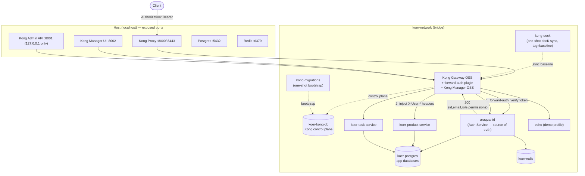
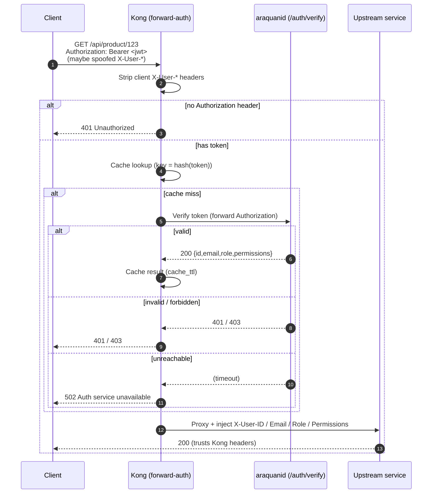
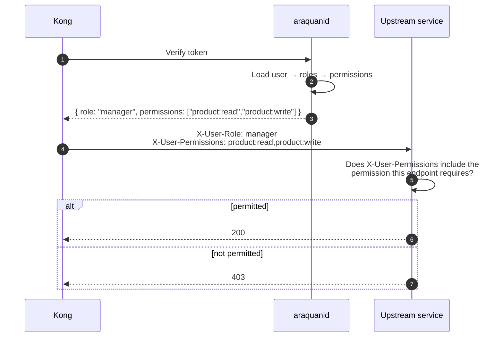

# Infernape Platform Architecture

Infernape is the local API platform for the **Koer** microservices ecosystem. It fronts the
services with **Kong Gateway OSS** and keeps authentication/authorization centralized in the
existing **araquanid** auth service. Kong never validates JWTs — it forward-auths to araquanid
and injects trusted identity headers downstream.

---

## 1. Architecture diagram



### Ports

| Component        | Container          | Host port            | Notes                                |
|------------------|--------------------|----------------------|--------------------------------------|
| Kong proxy       | `koer-kong`        | 8000 / 8443          | The only public entry point          |
| Kong Admin API   | `koer-kong`        | 127.0.0.1:8001       | Loopback only — never expose         |
| Kong Manager     | `koer-kong`        | 8002                 | OSS GUI (bundled in the Kong image)  |
| Postgres (apps)  | `koer-postgres`    | 5432                 | Application databases                |
| Postgres (Kong)  | `koer-kong-db`     | *(internal)*         | Kong control-plane state             |
| Redis            | `koer-redis`       | 6379                 | Cache / session store                |

---

## 2. Authentication flow



---

## 3. Authorization flow

Authorization remains owned by araquanid; downstream services enforce it from the trusted,
Kong-injected `X-User-Permissions` header — they never re-decode the JWT.



**Trust boundary.** Only Kong is published to the host. Upstream services live on the internal
`koer-network` and are unreachable directly, so they can safely trust `X-User-*`. Client-supplied
identity headers are stripped twice (global `request-transformer` + the forward-auth plugin) so they
can never reach an upstream.

---

## 4. Authentication approach comparison

| Approach | How it works | Pros | Cons | OSS? | Scalability | Ops complexity |
|---|---|---|---|---|---|---|
| **Kong JWT plugin** | Kong validates JWT signature using secrets stored as Kong consumer credentials | No extra hop; fast | **Auth logic + secrets move into Kong** → not centralized; revocation/permissions hard; secret sprawl | ✅ | High | Low–Med |
| **Kong OIDC plugin** | Kong acts as OIDC RP, validates tokens against an IdP | Standards-based; SSO | **Enterprise-only**; needs a full OIDC IdP | ❌ (EE) | High | High |
| **Forward Auth (chosen)** | Kong calls an external auth service per request; service returns identity; Kong injects headers | Auth stays centralized in araquanid; revocation/permissions live in one place; downstream stays simple | Extra hop per request (mitigated by caching); needs the verify endpoint | ✅ (via plugin) | High (cache + stateless) | Med |
| **Request Callout** | Native Kong plugin that calls another service mid-request | First-class, declarative | **Enterprise-only** | ❌ (EE) | High | Low |
| **Custom plugin** | Bespoke Lua/Go/JS plugin | Full control | Build/maintain a plugin | ✅ | High | Med–High |

**Decision:** Forward Auth implemented as a **minimal custom Lua plugin** (`forward-auth`).
Forward Auth keeps araquanid as the single source of truth; the only OSS way to express it is a
small plugin (OIDC and Request-Callout are Enterprise). The plugin is ~120 lines, uses only the
Kong PDK + bundled `lua-resty-http`, and is mounted into the stock image (no rebuild).

---

## 5. Configuration mode comparison

| Mode | Description | Pros | Cons |
|---|---|---|---|
| **DB-less** | Config from a YAML file at boot | Simple, immutable, GitOps-friendly | **No runtime writes → Kong Manager is read-only**; restart to change |
| **DB mode (chosen)** | Config in Postgres; Admin API + Manager write live | Dynamic config; Kong Manager fully usable; supports all entities | Requires Postgres + a migration step |
| **Hybrid (CP/DP)** | Control plane pushes to stateless data planes | Production scale-out | Overkill locally; more moving parts; some features EE |

**Decision: DB mode.** Developers need a *writable* Kong Manager UI and dynamic config, which
DB-less cannot provide. The cost is one Postgres (`koer-kong-db`) and a one-shot migration.

---

## 6. Service registration comparison

| Strategy | Description | Pros | Cons |
|---|---|---|---|
| **Manual** | Everything created in Kong Manager | Fast to start | Not reproducible; drifts; lost on `clean` |
| **Declarative** | Everything in Git, synced by decK | Reproducible; reviewable | Pure `deck sync` wipes anything not in the file |
| **Hybrid (chosen)** | Git baseline + Manager for ad-hoc | Reproducible baseline *and* dev freedom | Slightly more discipline (tagging) |

**Decision: Hybrid.** `kong/kong.yaml` is the Git baseline, applied by `deck gateway sync
--select-tag baseline`. decK only manages `baseline`-tagged entities, so experiments created in
Kong Manager survive re-syncs. Promote a keeper by adding it to `kong.yaml` with `tags: [baseline]`.

---

## 7. Header propagation & spoofing prevention

- **Injection mechanism:** the `forward-auth` plugin calls `kong.service.request.set_header(...)`
  in the access phase, setting `X-User-ID`, `X-User-Email`, `X-User-Role`, `X-User-Permissions`
  on the *upstream* request only.
- **Spoofing prevention (defense in depth):**
  1. A **global `request-transformer`** removes any client-supplied `X-User-*` headers.
  2. The **forward-auth plugin** clears them again before injecting trusted values.
  3. **Network isolation:** upstreams are not published to the host; only Kong can reach them, so
     a client cannot bypass the gateway.
- **Downstream expectation:** services trust `X-User-*` headers verbatim and must **not** re-validate
  the JWT. They enforce per-endpoint authorization from `X-User-Permissions`.

### araquanid `/auth/verify` contract

araquanid must expose a verification endpoint that Kong calls per request:

```
GET (or POST) /auth/verify
Request:  Authorization: Bearer <jwt>
200 OK    { "id": "...", "email": "...", "role": "...", "permissions": ["product:read", ...] }
401       invalid / expired / missing token
403       authenticated but not permitted
```

Configured via `AUTH_VERIFY_URL` (default `http://araquanid:8080/auth/verify`); confirm the real
host/port and update `.env`.

---

## 8. Startup sequence

`docker compose up -d` orchestrates the ordering via health/completion conditions:

```
postgres ─┐  redis ─┐                 (independent)
kong-database (healthy)
        └─> kong-migrations (bootstrap, exit 0)
                └─> kong (healthy)
                        └─> kong-deck (sync baseline, exit 0)
```

`make kong-bootstrap` and `make kong-sync` re-run the migration and baseline-sync steps on demand.

---

## 9. Enterprise-only features & OSS alternatives

| Want | Enterprise feature | OSS alternative used here / available |
|---|---|---|
| External/standards auth | OIDC plugin, Request Callout | `forward-auth` custom plugin → araquanid |
| Multi-tenancy | Workspaces | Tags + host/path routing conventions |
| GUI RBAC | Kong Manager RBAC | araquanid owns RBAC; Manager is unrestricted locally |
| Advanced rate limiting | `rate-limiting-advanced` | `rate-limiting` (OSS) + Redis |
| GUI Konnect/analytics | Konnect | `prometheus` plugin + Grafana |

---

## 10. Future roadmap

The platform is structured to grow without re-architecting:

- **API keys** — `key-auth` plugin for service-to-service / partner access.
- **Rate limiting** — `rate-limiting` plugin backed by the existing `koer-redis`.
- **RBAC** — keep policy in araquanid; optionally add the `acl` plugin for coarse gating.
- **OpenTelemetry** — `opentelemetry` plugin exporting traces.
- **Prometheus** — `prometheus` plugin + Kong status listener (`:8100`) scraped by Prometheus.
- **Grafana / Loki / Jaeger** — dashboards, log aggregation, trace UI as added Compose services.
- **Audit logging** — `http-log` / `file-log` plugins streaming request metadata.
- **Multi-tenancy** — tags + host routing now; Workspaces if/when moving to Enterprise.
- **Service mesh migration** — graduate east-west traffic to Kong Mesh / Kuma; Kong stays north-south.
- **Network segmentation** — split today's single `koer-network` into a public edge network (Kong
  only) and an internal network (databases + services) for stricter isolation.
